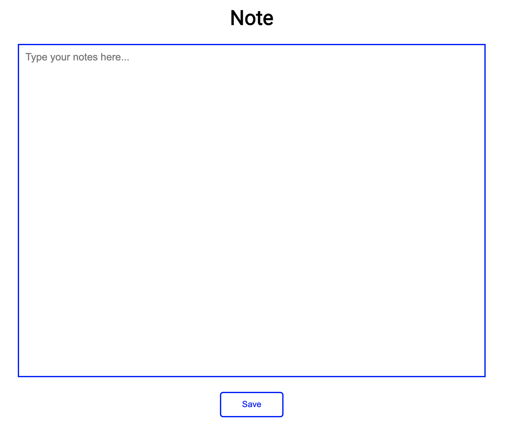
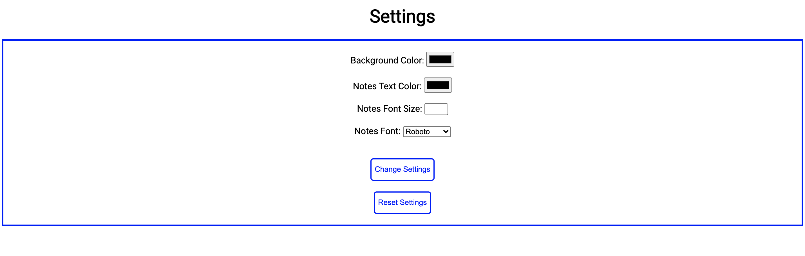

Note Taker
==================
### What is Note Taker?
Note Taker is a site where you can create digital notes to remember things. Once you create a note, it will be automatically stored in your device.

### How to create a new note:
1. At the top, click on `Notes`.
2. Click on `New Note`.
3. Enter a name for the new note. (The name can only contain alphanumeric characters and has to be less than 50 characters.)
4. A new tab will open, which is where you will type your notes.
Here's what it should look like:

### How to view a note:
You can also view a note. When you view a note, you won't be able to edit it.
1. At the top, click on `Notes`.
2. Under the name of the note you want to view, click on the `View` button.
3. A new tab will open, which is where you will view your notes.

### Download a note:
Note Taker allows you to download a note as a .txt file.
1. At the top, click on `Notes`.
2. Under the name of the note you want to download, click on `Download`.

### Rename a note:
1. At the top, click on `Notes`.
2. Under the name of the note you want to rename, click on `Rename`.
3. Enter a new name for the name and click on `Rename`. (The name can only contain alphanumeric characters and has to be less than 50 characters.)

### Delete a note:
If you don't need a note anymore, you can delete it.
1. At the top, click on `Notes`.
2. Under the name of the note you want to delete, click on `Delete`.
3. Confirm by clicking on `Delete`.

### Customize Settings
Note Taker lets you customize the settings, including the background, text color, font, and font size.

1. At the top, click on `Settings`.
2. You can change the color for the background color and text color of your notes. You can also enter a number for the notes font size. (The font size has to be at least 10 and cannot be more than 50.) To change the notes font, click on the dropdown menu and select a font size.
3. Click on `Change Settings`. The settings will be saved.

### Reset Settings
You might want to restore your settings back to the default settings.
1. At the top, click on `Settings`.
2. Click on `Reset Settings`. (Note: In the default settings, the background is white, the text color is black, the font size is 16, and the font is Roboto.)